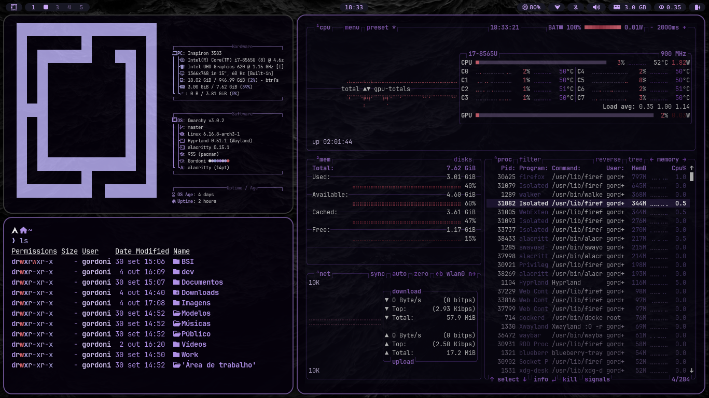
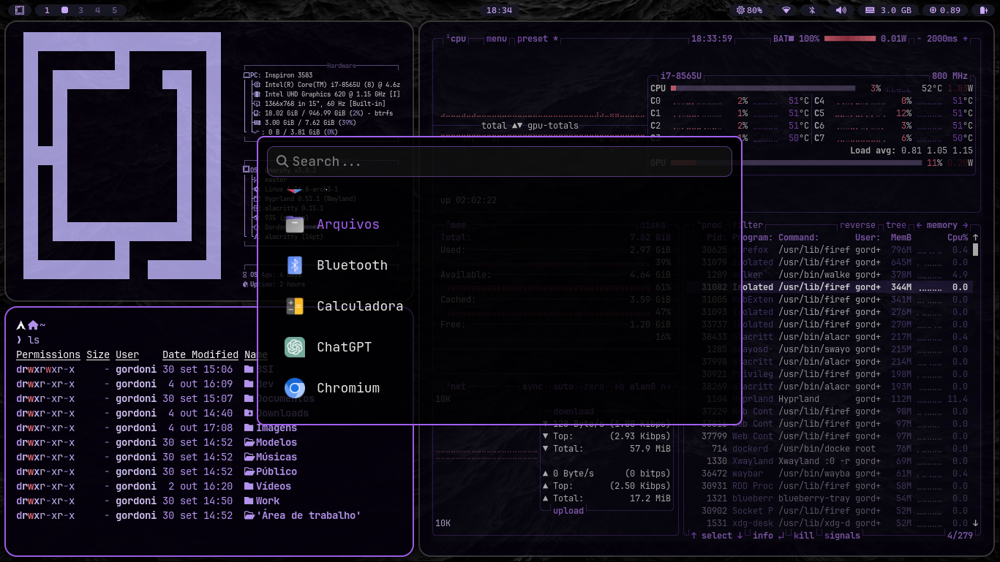
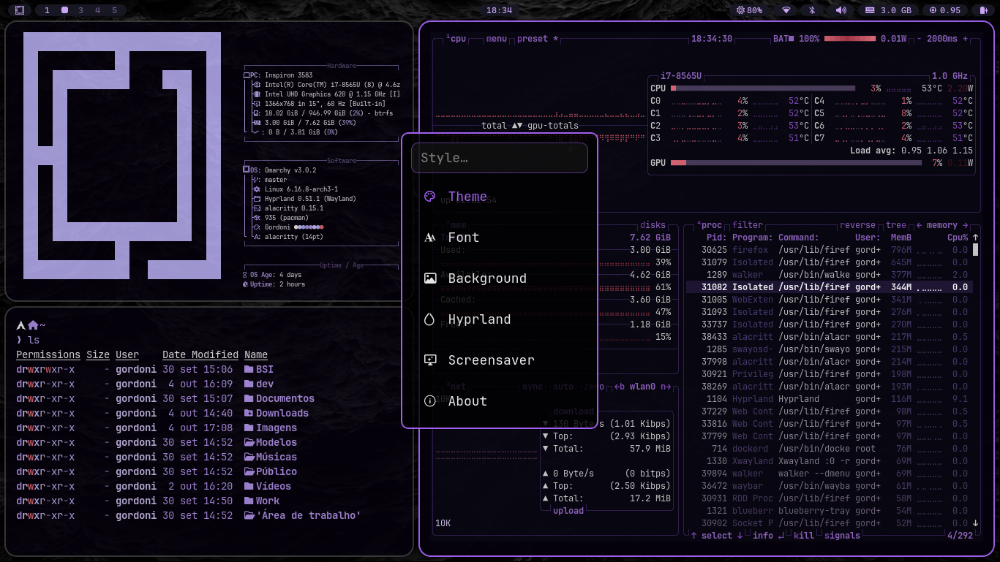

# Gordoni Theme

A custom theme for **[Omarchy](https://omarchy.org)**, created by combining features from other themes I liked.
The idea is simple: take useful elements from different themes, adapt them to my taste, and share them with anyone who might enjoy it.

> **Also check out:**
> * My settings for [Omarchy](https://github.com/gustavogordoni/dotfiles/).

[Versão em Português](README.md)

---

## Installation

```bash
omarchy-theme-install https://github.com/gustavogordoni/omarchy-gordoni-theme
````

---

## Preview

<div align="center">


</div>




<details>
<summary><strong>Show more</strong></summary>

<br>





</details>

<details>
<summary><strong>Wallpapers</strong></summary>

<br>


</details>

---

## Credits

This theme was inspired and developed using features from:

- [Ayaka](https://github.com/abhijeet-swami/omarchy-ayaka-theme)
- [Void](https://github.com/vyrx-dev/omarchy-void-theme.git)
- [Ayaka](https://github.com/abhijeet-swami/omarchy-ayaka-theme)
- [Void](https://github.com/vyrx-dev/omarchy-void-theme.git)
- [Pandora](https://github.com/imbypass/omarchy-pandora-theme)
- [Everpuccin](https://github.com/imbypass/omarchy-everpuccin-theme)
