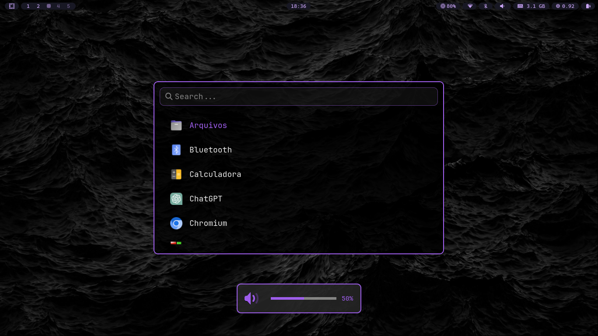
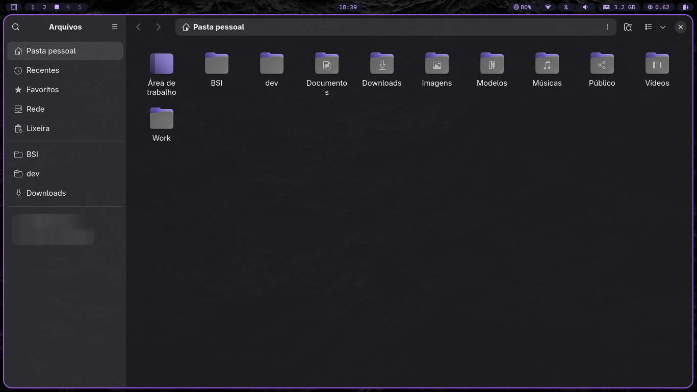

# Gordoni Theme

A custom theme for **Omarchy**, created by combining features from other themes I liked.
The idea is simple: take useful elements from different themes, adapt them to my taste, and share them with anyone who might enjoy it.

[Versão em Português](README.md)

---

## Installation

```bash
omarchy-theme-install https://github.com/gustavogordoni/omarchy-gordoni-theme
````

---

## Preview







---

## Credits

This theme was inspired and developed using features from:

* [Ayaka Theme](https://github.com/abhijeet-swami/omarchy-ayaka-theme)
* [Void Theme](https://github.com/vyrx-dev/omarchy-void-theme.git)
