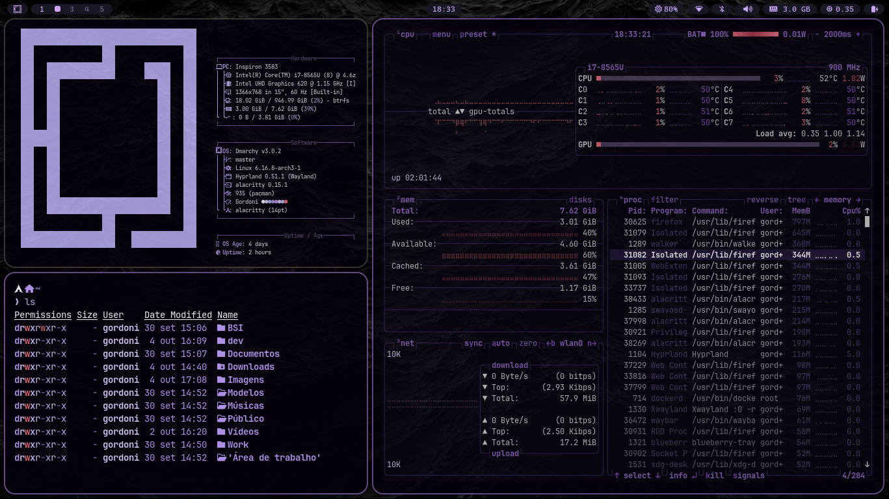
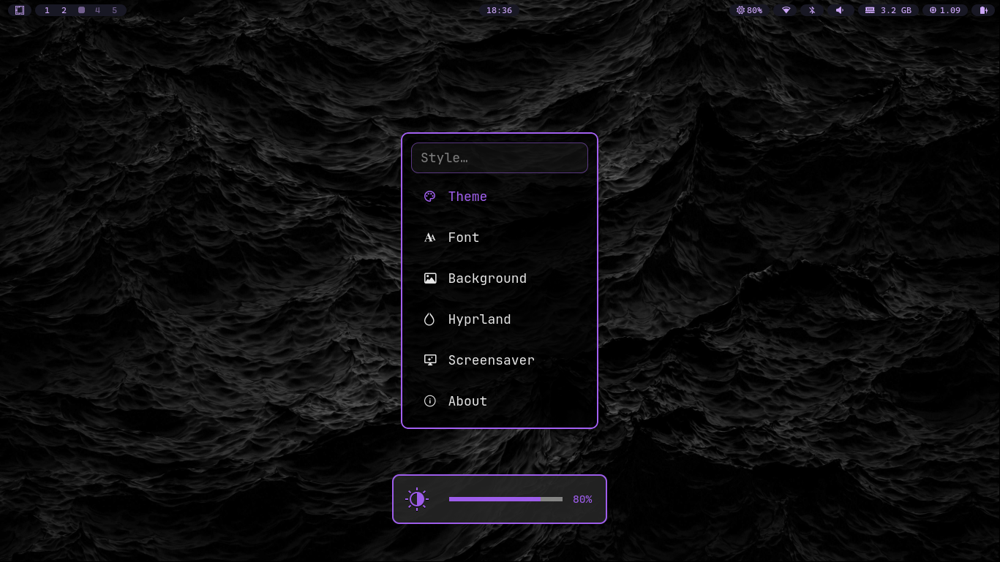
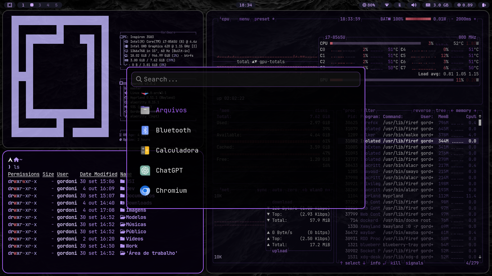
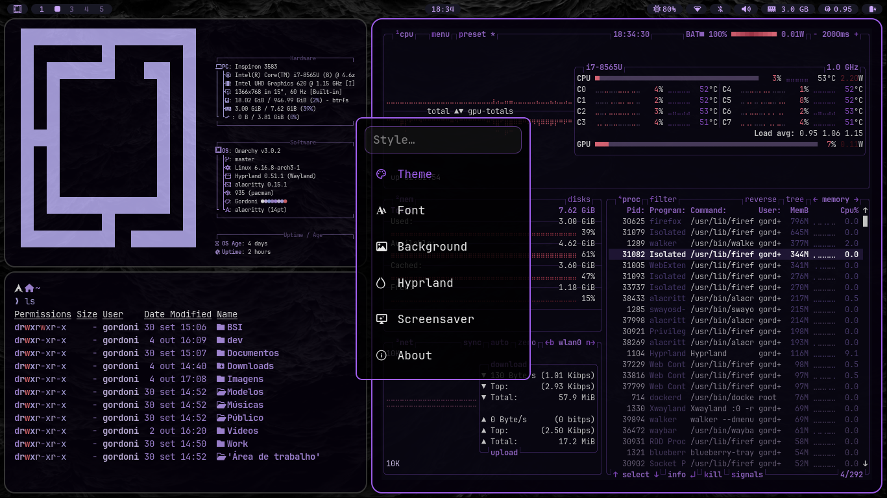
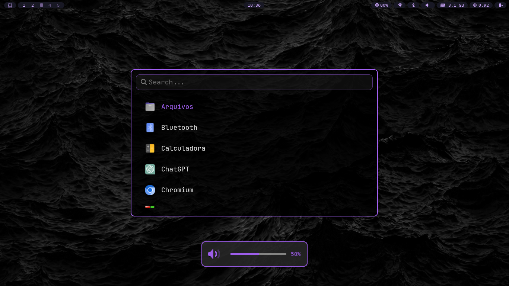
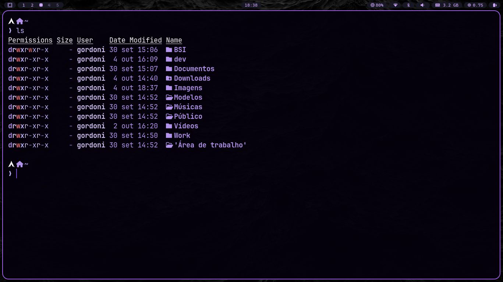
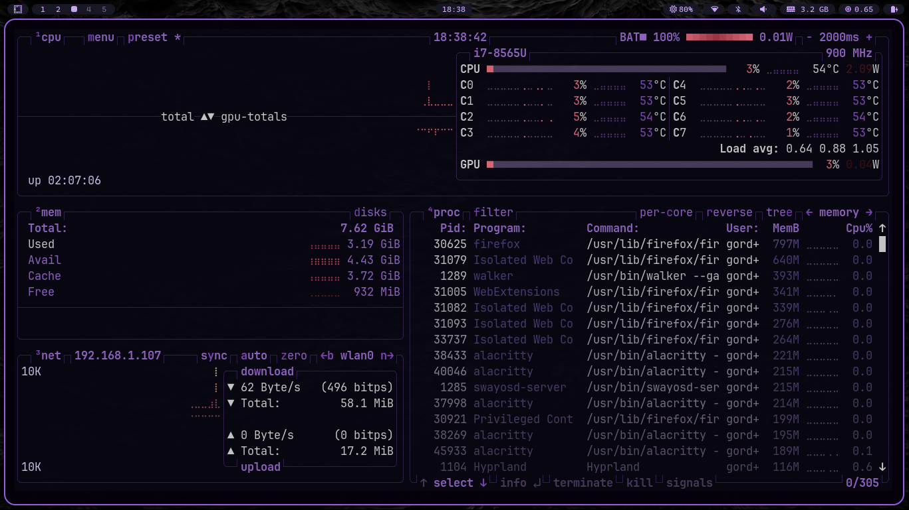
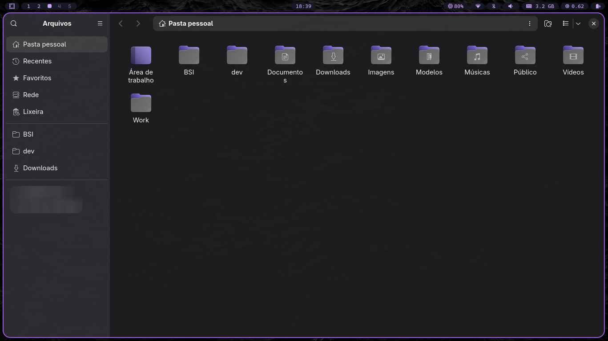

# Gordoni Theme

Um tema personalizado para **[Omarchy](https://omarchy.org)**, criado a partir da junção de recursos de outros temas que me agradaram.
A ideia é simples: aproveitar recursos de outros temas, adaptar ao meu gosto e compartilhar com alguém que possa curtir.

> **Confira também:**
>
> - Minhas configurações para o [Omarchy](https://github.com/gustavogordoni/dotfiles/).

[English Version](README.en.md)

---

## Instalação

```bash
omarchy-theme-install https://github.com/gustavogordoni/omarchy-gordoni-theme
```

---

## Prévia






<details>
<summary><strong>Veja mais</strong></summary>

<br>








</details>

<details>
<summary><strong>Wallpapers</strong></summary>

<br>


</details>

---

## Créditos

Este tema foi inspirado e desenvolvido a partir de recursos presentes nos temas:

- [Ayaka Theme](https://github.com/abhijeet-swami/omarchy-ayaka-theme)
- [Void Theme](https://github.com/vyrx-dev/omarchy-void-theme.git)
